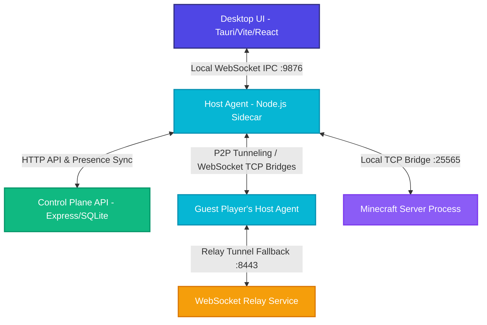

# 🎮 MC Hosting Platform

<p align="center">
  
</p>

<h3 align="center">Ultimate Standalone Monorepo for Instant Minecraft Server Hosting</h3>

> [!CAUTION]
> ### 🛡️ PROPRIETARY SOFTWARE & COPYRIGHT NOTICE
> **This repository is 100% proprietary. All rights are reserved.**
> - **UNAUTHORIZED COPYING, DUPLICATION, CLONING, PUBLIC FORKING, DISTRIBUTING, OR MODIFYING OF THE CODE IS STRICTLY PROHIBITED BY LAW.**
> - Doing so violates the [LICENSE](file:///c:/Users/kuti/Desktop/private_hosting_mc/LICENSE) of this repository and will trigger immediate legal enforcement, including DMCA Takedown requests, loss of developer/API credentials, and statutory damages claims.
> - For full legal terms, please read the official [LICENSE](file:///c:/Users/kuti/Desktop/private_hosting_mc/LICENSE) file in the root directory.

<p align="center">
  A premium, high-performance cross-platform (Windows & macOS) solution that allows users to deploy local Minecraft Java servers with <strong>zero-config port forwarding bypass</strong> (automated NAT traversal) and control them via a state-of-the-art glassmorphic desktop dashboard.
</p>

<p align="center">
  <a href="#-key-features"></a>
  <a href="#-technical-architecture"></a>
  <a href="#-monorepo-structure"></a>
  <a href="#-installation--setup"></a>
</p>

---

## 🌟 Key Features

* **⚡ One-Click Server Deployments:** Download, configure, and spin up custom Vanilla or PaperMC server instances in seconds.
* **🛡️ Zero-Config NAT Traversal:** Connect players across the globe without manual port forwarding. Powered by dynamic STUN candidate gathering, direct peer-to-peer TCP socket tunnels, and an automatic high-speed WebSocket relay fallback network.
* **💎 Premium Desktop GUI:** A beautiful React/Vite-based glassmorphic dashboard running inside a native Tauri 2.0 shell, providing real-time CPU/RAM resource profiling, streaming log outputs, and live console command executors.
* **💾 Automatic Backup Engine:** Highly configurable local ZIP scheduler. Auto-creates atomic system checkpoints at user-defined intervals and supports single-click point-in-time state restoration.
* **🌐 Device-Whitelisted Security:** Fully integrated `PolicyEnforcer` whitelists specific guest device IDs at the bridge layer, blocking arbitrary TCP clients from accessing private servers.
* **🇹🇷 Locale-Aware Safety:** Explicit custom String conversion methods designed to bypass complex case-folding bugs under Turkish OS locale settings (avoiding `i`/`I` character mapping failures).
* **🔍 Intelligent System Environment Checker:** Automated local Java JRE, Cloudflare tunnel CLI, and multi-launcher (Official, TLauncher, Legacy Launcher) discovery with directory scanning and version detection.
* **📚 Glassmorphic Turkish Knowledge Base:** Interactive, beautifully structured in-app guides for zero-config server configuration, CurseForge & modpack installation, PaperMC optimizations, and TLauncher online-mode connection workarounds.
* **📦 Native Bundler Pipeline:** Automatic build scripts that package Node.js host agents into self-contained native executable sidecars (Windows `x86_64`, macOS Apple Silicon `aarch64`, and macOS Intel `x86_64`) and embed them inside compressed NSIS installers, macOS `.app` bundles, or `.dmg` packages.

---

## 🌐 Technical Architecture

The platform separates the **Control Plane** (Tauri GUI & REST Backend API) from the **Data Plane** (Host Agent Sidecar & Minecraft Server process). This allows the game server and network proxy tunnels to run persistently even if the desktop GUI is restarted.



### Core Communication Pipelines
1. **Local IPC Layer:** A secure, local WebSocket loopback connection (`127.0.0.1:9876`) over which JSON-RPC commands are routed between the Tauri interface and the native Host Agent.
2. **Reverse Proxy Tunneling:** The Host Agent spawns an dynamic internal TCP proxy bridge. It maps Minecraft's default `25565` port to local host listeners and communicates with guest devices via direct TCP socket tunnels.
3. **Restricted-NAT Bypass (Relay Service):** If both devices are behind symmetric NAT networks, the Host Agent automatically establishes dual-sided WebSocket streams through the **Relay Service** (`wss://relay.mchosting.local:8443`), maintaining uninterrupted game traffic with minimal latency overhead.
4. **Presence Synchronization:** Host Agents register and announce their online states via periodic 30-second heartbeats synced directly to the Supabase Postgres DB layer.

---

## 🛠️ Monorepo Structure

The platform is managed as an NPM monorepo workspace for clean package separation:

```
├── apps/
│   ├── desktop-ui/       # React + Vite desktop dashboard running natively inside Tauri 2.0 (Port 3000)
│   ├── host-agent/       # Persistently active Node.js sidecar managing local MC processes & proxy bridges (Port 9876)
│   ├── backend-api/      # Express.js Control Plane API utilizing better-sqlite3 for auth & resource states (Port 3001)
│   └── relay-service/    # WebSocket proxy server routing encrypted game traffic when direct P2P fails (Port 8443)
├── packages/
│   └── shared-types/     # Shared TypeScript interfaces, network contracts, and custom model validations
├── docs/                 # Detailed documentation guides (Deployment, Privacy, Supabase, User Guide)
├── supabase/             # Database triggers, presence sync schemas, and migration scripts
└── scripts/              # Automated build pipelines, performance benchmarks, and end-to-end smoke test scripts
```

---

## 🔍 Intelligent System Environment Checker & Knowledge Base

To ensure maximum plug-and-play ease for non-technical users, MC Hosting features an advanced real-time environment checker and an interactive Turkish gaming knowledge base integrated natively inside the UI:

### 1. Real-Time Environment Checker
* **Java JRE Diagnostics:** Scans local paths and executes safe version queries to detect if **Java 17+** is active (crucial for Minecraft server `.jar` runtimes). If missing, it offers an instant download link to Adoptium.
* **Cloudflare CLI Detection:** Verifies if the optional `cloudflared` CLI binary is installed on the user's environment for HTTP/TCP tunnel fallback routing.
* **Multi-Launcher Scanning:** Automatically scans dynamic `%APPDATA%` and `%USERPROFILE%` pathways to discover local game clients, supporting **Official Minecraft**, **TLauncher**, and **Legacy Launcher**.
* **Local Version Inventory:** Performs depth-scans of the local `.minecraft/versions` subfolders and profiles up to 15 installed client versions directly onto the dashboard.

### 2. High-Fidelity Interactive Turkish Guides
* **🚀 One-Click Setup Guide:** Step-by-step walkthrough detailing how to boot a local server instance, allocate memory boundaries, and broadcast dynamic P2P Invite Codes.
* **📦 CurseForge & Modpacks Integration:** In-depth blueprints outlining server/client directory alignment, Forge/Fabric JAR configuration, and how to successfully synchronize local `mods` and `config` structures.
* **⚡ PaperMC Optimization Engine:** Architectural optimization tips focusing on `view-distance` adjustments in `paper-global.yml` and `spigot.yml` to dramatically stabilize TPS at a perfect `20.0`.
* **🛡️ TLauncher Connection Fix:** Detailed instructions for configuring `online-mode=false` under Server Settings to solve the notorious "Invalid session" error and enable offline TLauncher players to join via loopback proxy tunnels (`localhost:25566`).

---

## 💻 Tech Stack

| Module | Technologies | Details & Purpose |
| :--- | :--- | :--- |
| **Desktop UI** | React 18, Vite, Tailwind CSS, Zustand | Premium responsive interface utilizing glassmorphic aesthetics and live telemetry dashboards. |
| **Tauri Wrapper** | Rust, Tauri Shell Plugin, NSIS, DMG | Compiles the web view into a native Windows or macOS application wrapper, bundling platform-specific sidecar binaries. |
| **Host Agent** | Node.js 18, TypeScript, `ws`, `pkg` | Standalone sidecar that launches the MC server, hooks `stdout/stdin`, and creates proxy sockets. |
| **Control Plane API** | Express.js, `better-sqlite3`, JWT | Manages user accounts, session authorization, rate limiting, and persistent device records. |
| **Relay Service** | Node.js Stream Bridges, `ws` | Handles dual-socket pipe operations, linking host and player streams across complex firewalls. |
| **Shared Types** | TypeScript | Ensures structural type-safety and contract matching across all monorepo microservices. |
| **Security Layer** | bcryptjs, Dynamic Device Whitelists | Enforces cryptographic token expiration and Whitelists authorized player hardware. |

---

## 🚀 Installation & Setup

Choose the installation pathway that fits your use case. **Path A** is designed for regular users who want to host servers instantly with **zero configuration**. **Path B** is designed for developers or advanced self-hosters running from source.

### 🌟 Path A: Quick End-User Install (Recommended)
Regular players and hosts do NOT need to clone the repository, install Node.js/Rust, or configure any databases.
1. Go to the **GitHub Releases** page on this repository.
2. Download the latest compiled installer for your operating system:
   * **Windows**: `MC Hosting_0.1.0_x64-setup.exe`
   * **macOS (Apple Silicon / M1 / M2 / M3 / M4)**: `MC Hosting_0.1.0_universal.dmg` (or `_aarch64.dmg`)
   * **macOS (Intel)**: `MC Hosting_0.1.0_universal.dmg` (or `_x64.dmg`)
3. Install the application:
   * **Windows**: Double-click the `.exe` and follow the premium NSIS Setup Wizard.
   * **macOS**: Open the `.dmg` and drag the **MC Hosting** app into your Applications folder.
4. Launch **MC Hosting**!
5. **Zero-Config Cloud Auth**: Register or log in instantly using your **Google** or **GitHub** account. The client comes pre-packaged to connect to our high-performance cloud presence system out-of-the-box.

---

### 💻 Path B: Developer / Self-Hoster Setup
If you want to run the platform locally or host your own private control plane database and authentication network, follow these steps:

#### 1. System Prerequisites
Ensure the following are installed on your computer:
* **Node.js**: v18.0.0 or later (Node 20+ strongly recommended)
* **Rust & Cargo**: (Only needed if compiling/packaging the native Tauri desktop app)
* **Visual Studio C++ Build Tools**: (Required for Windows compilation)
* **Java Runtime (JRE)**: v17 or later (Required on the host running the Minecraft server)

#### 2. One-Click Setup & Dependencies
We provide automated wizards to install dependencies and configure local environment settings:
* **On Windows (Double-Click)**:
  Simply run `setup.bat` in the root folder.
* **On Linux/macOS (Terminal)**:
  Run the setup shell script:
  ```bash
  chmod +x setup.sh
  ./setup.sh
  ```
* *The setup wizard automatically checks your Node.js version, installs monorepo dependencies, and copies template `.env` configurations.*
* **Setting up custom Auth & DB**: If you want to connect the app to your own private Supabase instance and register your own custom **Google/GitHub OAuth applications**, please follow our comprehensive [Supabase Setup Guide](file:///Users/kutay/Desktop/gh/Private-Hosting-App/docs/SUPABASE_SETUP.md).


#### 3. One-Click Concurrent Bootstrapper
Once the setup script finishes, you can start all services concurrently:
* **On Windows (Double-Click):**
  Simply run `start.bat` in the root folder.
* **On Linux/macOS (Terminal):**
  Run the startup script:
  ```bash
  ./start.sh
  ```
* *This launches the React Frontend dashboard, persistent Host Agent IPC daemon, and the Express database REST server concurrently with full hot-reloading enabled.*

---

## 📦 Compiling & Packaging the Application

The project features a highly specialized packaging pipeline that compiles Node.js services into binary executables and wraps them natively inside the Tauri installation bundle, delivering a completely self-contained setup package.

### The Build Pipeline:
1. Compiles the TypeScript source code for `@mc-host/shared-types`, `apps/backend-api`, and `apps/host-agent`.
2. Packages the Host Agent into a standalone executable using `pkg` for your target platform:
   * **Windows x64:** `host-agent-x86_64-pc-windows-msvc.exe`
   * **macOS Apple Silicon:** `host-agent-aarch64-apple-darwin`
   * **macOS Intel:** `host-agent-x86_64-apple-darwin`
3. Copies the compiled sidecar binaries directly into Tauri's source folder (`apps/desktop-ui/src-tauri/bin/`).
4. Runs the Tauri native packaging command to bundle the static React frontend and native sidecars.
5. Optimizes backgrounds: ensures the Host Agent runs silently without noisy terminal windows (via conditional subsystems in Rust and custom launchers).

### Executing the Build Pipeline:

* **On Windows:**
  ```cmd
  scripts\build-installer.bat
  ```
  * **Artifact Output:** `apps/desktop-ui/src-tauri/target/release/bundle/nsis/MC Hosting_0.1.0_x64-setup.exe`

* **On macOS (Intel / Apple Silicon):**
  ```bash
  chmod +x scripts/build-installer.sh
  ./scripts/build-installer.sh
  ```
  * **Universal App Build:** The script will automatically detect if both macOS targets (`aarch64` and `x86_64`) are installed in Rust via `rustup`. If available, it compiles a single **Universal App** that runs natively on both platforms. Otherwise, it compiles a highly-optimized native app for your current Mac processor.
  * **Artifact Output:**
    * Native app bundle: `apps/desktop-ui/src-tauri/target/release/bundle/macos/MC Hosting.app`
    * Distributable installer: `apps/desktop-ui/src-tauri/target/release/bundle/dmg/MC Hosting_0.1.0_aarch64.dmg` (or `_x64.dmg` / `_universal.dmg` depending on build configuration)

---

## 🧪 Testing Suites & Validation

The codebase features robust automated testing tools to ensure end-to-end stability before publishing.

### Unit Tests
Execute unit and component boundary tests across separate workspaces:
```bash
npm test -w apps/desktop-ui      # Executes Frontend Vitest environment tests
npm test -w apps/backend-api     # Executes API authentication, JWT, and Rate Limiter tests
npm test -w packages/shared-types # Validates models and types
```

### End-to-End (E2E) Smoke Test
Verify the integration of the entire system—including database connections, JWT sign-ins, Host Agent IPC hooks, active Minecraft server downloads, ZIP backups, and local client TCP proxies:
```bash
node scripts/e2e-smoke-test.js
```

### Performance & Load Tests
Measure API rate limiters and relay server load thresholds:
```bash
node scripts/load-test.js        # Stress-tests the HTTP Control Plane API
node scripts/relay-load-test.js  # Stress-tests connection bridges and message relays
```

---

## 🛡️ Production & Security Safeguards

* **Rate-Limit Enforcement:** Express APIs utilize in-memory rate limiters to defend authentication routes from brute-force access attempts.
* **TCP Whitelisting (Policy Enforcer):** Player clients attempting to join a hosted tunnel must provide a whitelisted device ID matching the invite code, preventing arbitrary external connections.
* **Safe String Conversions:** Every dynamic string case conversion in the Agent uses a specialized ASCII locale handler. This prevents critical directory parsing crashes caused by OS-level Turkish case-folding bugs (e.g. converting `i` to `İ` incorrectly).

---

## 📄 License & Attribution

Proprietary platform. All rights reserved. Developed and maintained by the **MC Hosting Development Team**.
