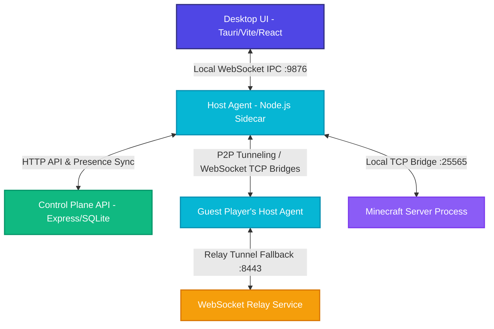

# 🎮 MC Hosting Platform

<p align="center">
  
</p>

<h3 align="center">Ultimate Standalone Monorepo for Instant Minecraft Server Hosting</h3>

<p align="center">
  A premium, high-performance Windows-based solution that allows users to deploy local Minecraft Java servers with <strong>zero-config port forwarding bypass</strong> (automated NAT traversal) and control them via a state-of-the-art glassmorphic desktop dashboard.
</p>

<p align="center">
  <a href="#-key-features"></a>
  <a href="#-technical-architecture"></a>
  <a href="#-monorepo-structure"></a>
  <a href="#-installation--setup"></a>
</p>

---

## 🌟 Key Features

* **⚡ One-Click Server Deployments:** Download, configure, and spin up custom Vanilla or PaperMC server instances in seconds.
* **🛡️ Zero-Config NAT Traversal:** Connect players across the globe without manual port forwarding. Powered by dynamic STUN candidate gathering, direct peer-to-peer TCP socket tunnels, and an automatic high-speed WebSocket relay fallback network.
* **💎 Premium Desktop GUI:** A beautiful React/Vite-based glassmorphic dashboard running inside a native Tauri 2.0 shell, providing real-time CPU/RAM resource profiling, streaming log outputs, and live console command executors.
* **💾 Automatic Backup Engine:** Highly configurable local ZIP scheduler. Auto-creates atomic system checkpoints at user-defined intervals and supports single-click point-in-time state restoration.
* **🌐 Device-Whitelisted Security:** Fully integrated `PolicyEnforcer` whitelists specific guest device IDs at the bridge layer, blocking arbitrary TCP clients from accessing private servers.
* **🇹🇷 Locale-Aware Safety:** Explicit custom String conversion methods designed to bypass complex case-folding bugs under Turkish OS locale settings (avoiding `i`/`I` character mapping failures).
* **📦 Native Bundler Pipeline:** Automatic build script that packages Node.js host agents into self-contained native executable sidecars and embeds them inside a compressed NSIS Windows installer.

---

## 🌐 Technical Architecture

The platform separates the **Control Plane** (Tauri GUI & REST Backend API) from the **Data Plane** (Host Agent Sidecar & Minecraft Server process). This allows the game server and network proxy tunnels to run persistently even if the desktop GUI is restarted.



### Core Communication Pipelines
1. **Local IPC Layer:** A secure, local WebSocket loopback connection (`127.0.0.1:9876`) over which JSON-RPC commands are routed between the Tauri interface and the native Host Agent.
2. **Reverse Proxy Tunneling:** The Host Agent spawns an dynamic internal TCP proxy bridge. It maps Minecraft's default `25565` port to local host listeners and communicates with guest devices via direct TCP socket tunnels.
3. **Restricted-NAT Bypass (Relay Service):** If both devices are behind symmetric NAT networks, the Host Agent automatically establishes dual-sided WebSocket streams through the **Relay Service** (`wss://relay.mchosting.local:8443`), maintaining uninterrupted game traffic with minimal latency overhead.
4. **Presence Synchronization:** Host Agents register and announce their online states via periodic 30-second heartbeats synced directly to the Supabase Postgres DB layer.

---

## 🛠️ Monorepo Structure

The platform is managed as an NPM monorepo workspace for clean package separation:

```
├── apps/
│   ├── desktop-ui/       # React + Vite desktop dashboard running natively inside Tauri 2.0 (Port 3000)
│   ├── host-agent/       # Persistently active Node.js sidecar managing local MC processes & proxy bridges (Port 9876)
│   ├── backend-api/      # Express.js Control Plane API utilizing better-sqlite3 for auth & resource states (Port 3001)
│   └── relay-service/    # WebSocket proxy server routing encrypted game traffic when direct P2P fails (Port 8443)
├── packages/
│   └── shared-types/     # Shared TypeScript interfaces, network contracts, and custom model validations
├── docs/                 # Detailed documentation guides (Deployment, Privacy, Supabase, User Guide)
├── supabase/             # Database triggers, presence sync schemas, and migration scripts
└── scripts/              # Automated build pipelines, performance benchmarks, and end-to-end smoke test scripts
```

---

## 💻 Tech Stack

| Module | Technologies | Details & Purpose |
| :--- | :--- | :--- |
| **Desktop UI** | React 18, Vite, Tailwind CSS, Zustand | Premium responsive interface utilizing glassmorphic aesthetics and live telemetry dashboards. |
| **Tauri Wrapper** | Rust, Tauri Shell Plugin, NSIS | Compiles the web view into a native Windows application wrapper, bundling sidecar binaries. |
| **Host Agent** | Node.js 18, TypeScript, `ws`, `pkg` | Standalone sidecar that launches the MC server, hooks `stdout/stdin`, and creates proxy sockets. |
| **Control Plane API** | Express.js, `better-sqlite3`, JWT | Manages user accounts, session authorization, rate limiting, and persistent device records. |
| **Relay Service** | Node.js Stream Bridges, `ws` | Handles dual-socket pipe operations, linking host and player streams across complex firewalls. |
| **Shared Types** | TypeScript | Ensures structural type-safety and contract matching across all monorepo microservices. |
| **Security Layer** | bcryptjs, Dynamic Device Whitelists | Enforces cryptographic token expiration and Whitelists authorized player hardware. |

---

## 🚀 Installation & Setup

### Prerequisites
* **Node.js:** v18.0.0 or later (Node 20+ strongly recommended)
* **Rust & Cargo:** (Needed for compiling the native Tauri GUI application)
* **Visual Studio C++ Build Tools:** (Required Windows compilation tooling)
* **Java Runtime:** v17 or later (Installed locally to run the Minecraft Server JARs)

### 1. Repository Installation
Clone the repository and install all dependencies for workspaces from the root folder:
```bash
npm install
```

### 2. Configure Environment Configurations
Ensure your Supabase parameters are set. Create local environment configs in their respective packages:

* In `apps/desktop-ui/.env`:
  ```env
  VITE_API_URL=http://localhost:3001
  VITE_RELAY_URL=ws://localhost:8443
  ```
* In `apps/host-agent/.env`:
  ```env
  API_URL=http://localhost:3001
  RELAY_URL=ws://localhost:8443
  IPC_PORT=9876
  ```

### 3. Launching in Development Mode
You can spin up all workspaces concurrently with a single command from the monorepo root:
```bash
npm run dev
```
Alternatively, launch specific services individually using targeted workspace scripts:
```bash
npm run dev:ui       # Boots Vite Desktop UI Dev server (Port 3000)
npm run dev:agent    # Boots Host Agent Sidecar daemon (Port 9876)
npm run dev:api      # Boots Control Plane REST Server (Port 3001)
```

---

## 📦 Compiling & Packaging the Application

The project features a highly specialized packaging pipeline that compiles all Node.js services into binary executables and wraps them natively inside the Tauri installation bundle. This delivers a completely self-contained installer for the end-user.

### The Build Pipeline:
1. Compiles the TypeScript code inside `packages/shared-types`, `apps/backend-api`, and `apps/host-agent`.
2. Packages the Node.js Host Agent into a standalone binary (`host-agent-x86_64-pc-windows-msvc.exe`) using the `pkg` tool.
3. Places the compiled binary into Tauri's native sidecars directory (`apps/desktop-ui/src-tauri/bin/`).
4. Runs the Tauri compiler to create the production application bundle.
5. Employs conditional subsystem compilation in Rust to ensure the Host Agent runs cleanly in the background without spawning noisy console windows.

To execute the full production build pipeline, run the following script:
```cmd
scripts\build-installer.bat
```
### Compiled Artifact Output:
* **Format:** Windows NSIS Setup Wizard (`.exe`)
* **Path:** `apps/desktop-ui/src-tauri/target/release/bundle/nsis/MC Hosting_0.1.0_x64-setup.exe`

---

## 🧪 Testing Suites & Validation

The codebase features robust automated testing tools to ensure end-to-end stability before publishing.

### Unit Tests
Execute unit and component boundary tests across separate workspaces:
```bash
npm test -w apps/desktop-ui      # Executes Frontend Vitest environment tests
npm test -w apps/backend-api     # Executes API authentication, JWT, and Rate Limiter tests
npm test -w packages/shared-types # Validates models and types
```

### End-to-End (E2E) Smoke Test
Verify the integration of the entire system—including database connections, JWT sign-ins, Host Agent IPC hooks, active Minecraft server downloads, ZIP backups, and local client TCP proxies:
```bash
node scripts/e2e-smoke-test.js
```

### Performance & Load Tests
Measure API rate limiters and relay server load thresholds:
```bash
node scripts/load-test.js        # Stress-tests the HTTP Control Plane API
node scripts/relay-load-test.js  # Stress-tests connection bridges and message relays
```

---

## 🛡️ Production & Security Safeguards

* **Rate-Limit Enforcement:** Express APIs utilize in-memory rate limiters to defend authentication routes from brute-force access attempts.
* **TCP Whitelisting (Policy Enforcer):** Player clients attempting to join a hosted tunnel must provide a whitelisted device ID matching the invite code, preventing arbitrary external connections.
* **Safe String Conversions:** Every dynamic string case conversion in the Agent uses a specialized ASCII locale handler. This prevents critical directory parsing crashes caused by OS-level Turkish case-folding bugs (e.g. converting `i` to `İ` incorrectly).

---

## 📄 License & Attribution

Proprietary platform. All rights reserved. Developed and maintained by the **MC Hosting Development Team**.
