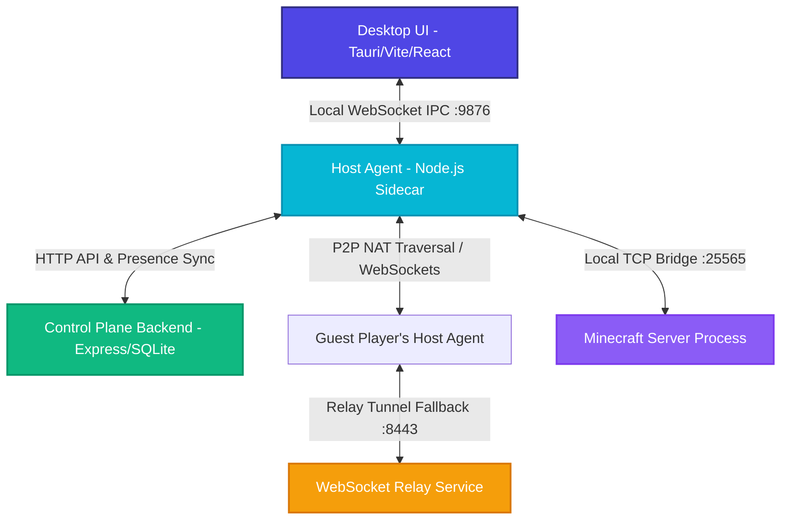

# 🎮 MC Hosting Platform - Ultimate Minecraft Server Hosting

<p align="center">
  
</p>

<p align="center">
  <strong>Windows-based standalone monorepo enabling instant Minecraft Java server hosting with automated zero-config NAT traversal (port forwarding bypass) and a premium desktop control panel.</strong>
</p>

---

## 🚀 Key Highlights

* **One-Click Server Deployment:** Spin up Vanilla or PaperMC servers in seconds.
* **Zero-Config Port Forwarding Bypass:** Uses dynamic STUN/NAT Traversal candidate gathering with automatic P2P socket tunneling and a fallback WebSocket relay system.
* **Premium Glassmorphism Control Panel:** Beautiful desktop dashboard wrapper compiling directly to native Windows executables (Tauri) with real-time log streaming and command execution.
* **Robust Backup Scheduler:** Local ZIP-archived backup creator with configurable intervals and simple point-in-time restoration.
* **Locale-Aware Safety:** Custom bypasses implemented to prevent case-folding bugs under Turkish locale configurations (ASCII casing preservation).

---

## 🌐 Technical Architecture

The platform separates the **Veri Düzlemi (Data Plane)** from the **Kontrol Düzlemi (Control Plane)**, allowing the desktop UI to run completely decoupled from the local service lifecycle.



### Communication Flow under the Hood
1. **IPC Layer**: WebSocket JSON protocol bound strictly to `127.0.0.1:9876` allowing the Frontend and the Host Agent to talk in real-time.
2. **NAT Traversal Protocol**: Gathers candidate connection endpoints using STUN. If P2P connection succeeds, game traffic routes via direct TCP socket. If NAT type is restricted, traffic bridges via the **Relay Service** (`wss://relay.mchosting.local`).
3. **Presence Engine**: Heartbeats are updated to the Supabase Cloud backend (`hmmfmgelowozwzapxwlm.supabase.co`) every 30 seconds to announce online status and route incoming players.

---

## 🛠️ Workspaces & Monorepo Structure

This project uses an NPM monorepo structure, organizing features into discrete packages:

```
├── apps/
│   ├── desktop-ui/       # React + Vite frontend packaged natively inside Tauri 2.0 (Port 3000)
│   ├── host-agent/       # Standalone Node.js service managing server processes & IPC (Port 9876)
│   ├── backend-api/      # Express.js REST control plane API + better-sqlite3 (Port 3001)
│   └── relay-service/    # WebSocket proxy server routing traffic when P2P is blocked (Port 8443)
├── packages/
│   └── shared-types/     # Shared TypeScript models and interface contracts
├── scripts/              # Automated build, E2E smoketesting, and loadtesting scripts
└── supabase/             # SQL schemas and migration configurations
```

---

## 💻 Tech Stack

| Module | Core Technologies |
| :--- | :--- |
| **Desktop UI** | React 18, Vite, TypeScript, Tailwind CSS, Zustand, JSDOM |
| **Tauri Core** | Rust, Tauri Shell Plugin (`tauri-plugin-shell`) |
| **Host Agent** | Node.js 18, TypeScript, `ws`, `pkg` (executable packaging), GDI+ |
| **Control Plane API** | Express.js, `better-sqlite3`, JWT authentication, `bcryptjs` |
| **Relay Server** | WebSocket Servers, Node.js Stream bridging |
| **Database Sync** | Supabase JS client v2 (Heartbeats, devices, presence metadata) |

---

## 🚀 Getting Started

### Prerequisites
* **Node.js** v18 or later (Node 20+ recommended)
* **Rust & Cargo** (for building the Tauri GUI)
* **Java v17+** (required for starting Minecraft Server `.jar` packages)
* **NPM** (configured for monorepo workspaces)

### 1. Installation
Clone the repository and install all monorepo dependencies from the root directory:
```bash
npm install
```

### 2. Running in Development Mode
You can spin up all workspaces concurrently (UI dev server, Host Agent, and Control Plane Backend) with one command:
```bash
npm run dev
```

Or target individual services if you are working on a single layer:
```bash
npm run dev:ui       # Launch Desktop UI only (Port 3000)
npm run dev:agent    # Launch Host Agent only (Port 9876)
npm run dev:api      # Launch Backend API only (Port 3001)
```

---

## 📦 Production Builds & Compilation

The project compiles to a standalone, zero-dependency installation wizard on Windows, removing the need for end users to install Node.js manually.

### Compilation Pipeline
The platform utilizes a structured build process which:
1. Compiles TypeScript inside `shared-types`, `backend-api`, and `host-agent`.
2. Packages the Node.js Host Agent into a standalone binary using `pkg` (`host-agent-x86_64-pc-windows-msvc.exe`).
3. Embeds the agent binary inside the Tauri bundle as a native Rust sidecar.
4. Suppresses cmd/terminal window spawning for the UI using conditional release subsystem flags.
5. Builds the production installer using Tauri's Cargo bundler.

To execute the entire pipeline and generate the installer:
```cmd
scripts\build-installer.bat
```

### Output Target
* **Installer Format:** NSIS Setup Wizard (`.exe`)
* **Output File:** `MC Hosting_0.1.0_x64-setup.exe`
* **Output Location:** `apps/desktop-ui/src-tauri/target/release/bundle/nsis/`

---

## 🧪 Testing Suites

Run automated test suites across all monorepo packages:

### Workspace Unit Tests
Run unit tests for active packages (includes vitest UI tests and Jest API tests):
```bash
npm test -w apps/desktop-ui      # UI Boundary and state tests
npm test -w apps/backend-api     # Auth and rate-limiter tests
npm test -w packages/shared-types # Data model tests
```

### E2E Smoke Tests
Validate the entire lifecycle (HTTP endpoints, database heartbeats, WS IPC, rate limiting, and player proxy connections):
```bash
node scripts/e2e-smoke-test.js
```

---

## 🔒 Security & Policy Enforcing

* **JWT Verification:** All control plane routes are protected by JSON Web Tokens with a 1-hour access decay and a 7-day slide refresh window.
* **Rate Limiting:** Protects authorization endpoints against rapid floods and dictionary attacks using Express memory-store rate limiters.
* **Connection Security:** Uses `PolicyEnforcer` to whitelist specific guest device IDs, preventing unauthorized clients from joining active server proxies.

---

## 📄 License

Proprietary Software. All rights reserved. Managed by the MC Hosting Development Team.
